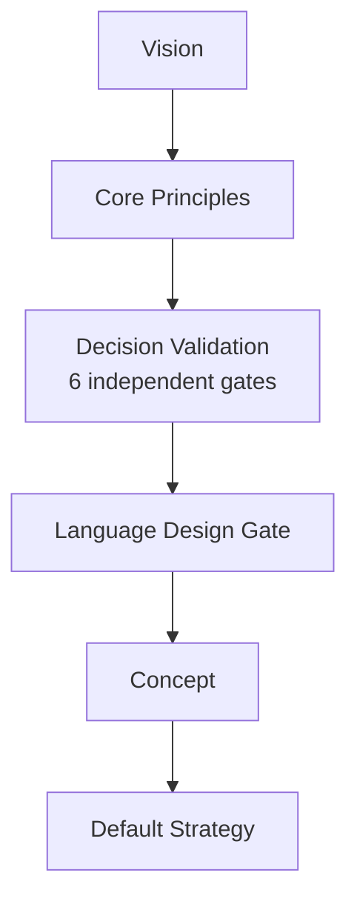

# Orthon Design Philosophy

Orthon follows a sequential design process: every language concept travels
from the fundamental *why* to a concrete implementation. This document
describes the flow of Orthon's design philosophy — the five layers through
which any language decision passes.

Each layer answers its own question and passes the result to the next:

| Layer | Question | Result | Document |
|---|---|---|---|
| Vision | *Why does the language exist?* | Direction, top-level values | [`docs/why/VISION.md`](../why/VISION.md) |
| Core Principles | *What rules do we follow?* | Concrete criteria for every decision | [`docs/why/MANIFESTO.md`](../why/MANIFESTO.md), [`docs/what/DESIGN_PRINCIPLES.md`](../what/DESIGN_PRINCIPLES.md) |
| Decision Validation | *Does the proposal pass all independent validation gates?* | Multi-perspective assessment of the proposal | [`docs/how/gates/DECISION_VALIDATION.md`](gates/DECISION_VALIDATION.md) |
| Language Design Gate | *Does the solution satisfy the principles?* | Approval or rejection of the concept | [`docs/how/gates/_language-design.md`](gates/_language-design.md) |
| Concept | *What are we introducing?* | Formal semantic definition | [`docs/what/concepts/`](../what/concepts/) |
| Default Strategy | *How is it implemented by default?* | Concrete implementation plan | [`docs/how/strategies/DEFAULT_STRATEGY.md`](strategies/DEFAULT_STRATEGY.md) |

---

## Layer 1: Vision

**File:** [`docs/why/VISION.md`](../why/VISION.md)

Vision is the foundation of Orthon. It defines *why* the language exists,
what problems it solves, and which values it follows.

Three pillars of Vision:

- **Language Designed Like Software** — the language is architected
  following SOLID principles. Core Language, Standard Library, and
  Implementation Strategy have clear responsibilities.
- **Learn from What Came Before** — Orthon inherits the best from Python
  (readability, approachable syntax) and Java (explicit semantics, static
  type safety), while fixing their shortcomings.
- **Comfortable by Design** — Principle of Least Astonishment: a
  construct's behavior must match a programmer's intuitive expectations.
  Orthogonality reinforces this comfort — once you learn a rule in one
  place, it applies everywhere.

**Output:** fundamental direction and top-level criteria that every
language decision must satisfy.

---

## Layer 2: Core Principles

**Files:** [`docs/why/MANIFESTO.md`](../why/MANIFESTO.md),
[`docs/what/DESIGN_PRINCIPLES.md`](../what/DESIGN_PRINCIPLES.md)

Principles translate Vision into concrete, verifiable rules. This is the
gateway between *why* and *what*: abstract values become criteria that can
be formally followed.

### Manifesto (10 Principles)

The Manifesto states the language's fundamental agreements:

- Consistency over historical compatibility
- One concept — one syntax
- One syntactic element — one responsibility
- Semantics over syntax
- Declarative over implicit
- No privileged language features
- Extensibility over built-in magic
- Composition over exceptions
- A unified declaration model
- Minimal core, maximum expressiveness

### Design Principles

Design Principles expand the Manifesto into three groups of rules:

- **Core Philosophy** — Data First, Orthogonality, Simplicity,
  Explicitness, Consistency, Uniformity, Explicit Semantics, Minimal Core,
  Transparency
- **Language Consistency** — Representation Symmetry, Deterministic
  Behavior, Stable Mental Model
- **Execution Model** — Semantics Before Optimization, Explicit
  Optimization, Correctness Before Performance

**Output:** a set of concrete rules that every new language decision must
satisfy.

---

## Layer 3: Decision Validation

**File:** [`docs/how/gates/DECISION_VALIDATION.md`](gates/DECISION_VALIDATION.md)

Before a proposal enters the Language Design Gate, it must first pass
through **Decision Validation** — a set of six independent validation
gates. Each gate examines the proposal from a different perspective:
user value, logical consistency, conceptual simplicity, architectural
integrity, implementation independence, and long-term maintainability.

The six gates are defined in
[`DECISION_VALIDATION.md`](gates/DECISION_VALIDATION.md) with detailed
criteria, pass/fail conditions, and a recommended flow.

**Output:** a multi-perspective assessment of the proposal (pass with
flags, or fail with documented issues to address).

---

### Layer 3a: Language Design Gate

**File:** [`docs/how/gates/_language-design.md`](gates/_language-design.md)

The Language Design Gate is a concrete checklist that operationalises
the six Decision Validation gates into a single review form. While
Decision Validation defines *what* must be checked and *why*, this
gate provides the *how* — a structured template for recording the
outcome.

Questions the Gate answers:

- Does this concept solve a real problem justified by the Vision?
- Does it violate any Manifesto or Design Principle?
- Is there a simpler or more orthogonal alternative?
- Does it satisfy the Principle of Least Astonishment?
- How does it compose with existing concepts?

**Output:** an approved concept (moves to formalization) or a rejected one
(returns for revision).

---

## Layer 4: Concept

**Files:** [`docs/what/concepts/`](../what/concepts/)

At this layer, an approved idea becomes a precise semantic definition.
This describes *what* is introduced, not *how* it is implemented.

Concept documents include:

- [`CORE_CONCEPTS.md`](../what/concepts/CORE_CONCEPTS.md) — Data and Data
  Modifiers as the fundamental entities
- [`DATA_MODEL.md`](../what/concepts/DATA_MODEL.md) — Value, Tuple,
  Reference, Sequence, Set, Option, Result
- [`FUNCTIONS.md`](../what/concepts/FUNCTIONS.md) — function model
- [`OWNERSHIP.md`](../what/concepts/OWNERSHIP.md) — ownership model
- [`MUTABILITY.md`](../what/concepts/MUTABILITY.md) — mutability
- [`ALLOCATION.md`](../what/concepts/ALLOCATION.md) — allocation
- [`EQUALITY.md`](../what/concepts/EQUALITY.md) — equality
- [`EXECUTION_PROGRAM.md`](../what/concepts/EXECUTION_PROGRAM.md) — execution
  model: Program, Execution Descriptor, Program Enricher, Execution Program,
  Execution Engines

Each document defines the semantics of a concept independent of
implementation: behavior, constraints, and interaction with other concepts.

**Output:** a formal semantic description of the concept, sufficient for
implementation and testing.

---

## Layer 5: Default Strategy

**File:** [`docs/how/strategies/DEFAULT_STRATEGY.md`](strategies/DEFAULT_STRATEGY.md)

The Default Strategy answers *how* a concept is implemented by default.
While Concept defines *what* the language must do, Strategy defines *how*
it will work in the compiler or runtime.

Unlike a single concept, multiple strategies may exist — each targeting a
different platform (high performance, embedded, etc.). The Default Strategy
is the implementation for the standard execution environment.

**Output:** a concrete implementation plan tied to the compiler and runtime
architecture.

---

## Example: Data Modifiers

This example traces a single concept through all five layers.

### 1. Vision

Vision states that the language must be comfortable and intuitive
(Comfortable by Design), and that each concept must have a single syntax
(orthogonality). Syntactic overhead is unacceptable — the programmer should
express intent, not mechanics.

### 2. Core Principles

Manifesto: "One concept — one syntax", "Semantics over syntax",
"Declarative over implicit".

Design Principles: "Data First" — data as the primary abstraction;
"Intent Over Implementation" — the programmer describes *what*, the
compiler decides *how*; "Explicit Semantics" — semantically significant
changes are visible in syntax.

### 3. Decision Validation

The six validation gates check the proposal from multiple perspectives.
Data modifiers address a real programmer need (User Value), their
definition is free of contradictions (Logical Consistency), and the
concept is a single-purpose transformation not expressible through
existing constructs (Conceptual Simplicity).

### 3a. Language Design Gate

The Gate checks: do data modifiers solve the problem of expressing intent
explicitly? Do they violate the minimal core principle? Do they compose
with existing concepts (functions, types)? Verdict: approved.

### 4. Concept

[`CORE_CONCEPTS.md`](../what/concepts/CORE_CONCEPTS.md) records:

> A Data Modifier transforms data into another representation. Each
> modifier expresses intent, while the compiler selects the most efficient
> implementation.

Examples: `tuple(...)` → Tuple, `set(...)` → Set, `sequence(...)` →
Sequence, `pack(...)` → packed values.

### 5. Default Strategy

The Default Strategy defines how the compiler implements each modifier:
which data structures to use, how to optimize, how to handle edge cases —
without changing the semantics defined at the Concept layer.

### 5. Default Strategy

Default Strategy defines how the compiler will implement each
modifier: which data structures to use, how to optimise,
how to handle edge cases — without changing the semantics defined at
the Concept layer.
