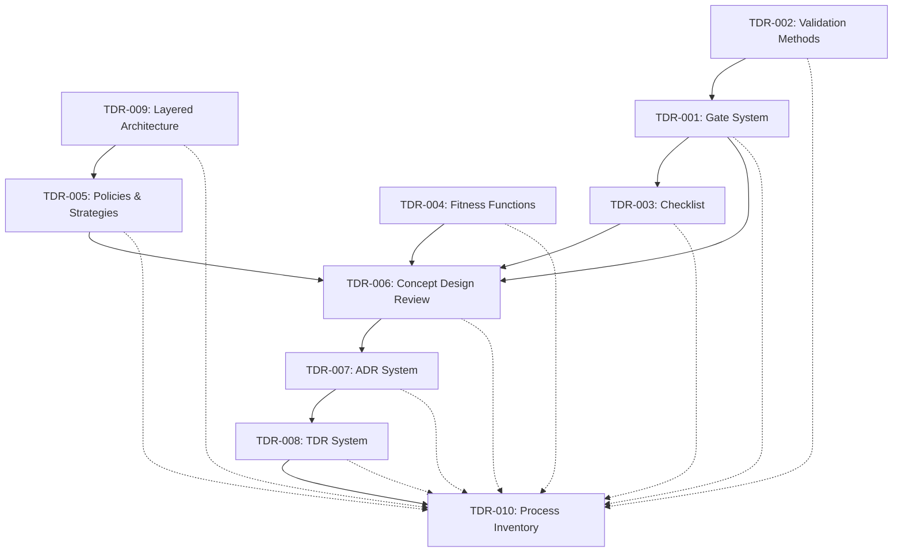

# Process Inventory

> Catalogue of process tools and approaches — the process-lens
> counterpart to `LANGUAGE_INVENTORY.md`. Answers the question:
> *what tools govern our design work, and what happens without them?*

---

## Overview

Every language design decision in Orthon is shaped by a set of
process tools: gates, methods, fitness functions, policies,
checklists, and procedures. This document catalogues them all in
one place, with their purpose, their TDR reference, and the
specific failure mode each one prevents.

| Tool | Type | TDR | What it prevents | Without it… |
|------|------|-----|------------------|-------------|
| Decision Validation Gates | Gate System | TDR-001 | Single-perspective validation; groupthink | Proposals pass on one lens, fail silently on others |
| Working Backwards | Method | TDR-002 | Building features nobody asked for | Language drifts from user needs |
| Socratic Method | Method | TDR-002 | Contradictions hidden by imprecise language | Ambiguity becomes specification |
| Scientific Method | Method | TDR-002 | Over-engineering disguised as completeness | Language bloats with unnecessary features |
| Logical Analysis | Method | TDR-002 | Layering violations that seem harmless | Architecture erodes through accumulated small breaches |
| TRIZ | Method | TDR-002 | Strategy compromises accepted too early | Implementation strategy becomes locked into semantics |
| Einstein's Method | Method | TDR-002 | Complexity that becomes permanent debt | Irreversible design mistakes |
| Language Design Gate Checklist | Checklist | TDR-003 | Gates without operational teeth | Surface-level validation; perfunctory gate-passing |
| Fitness Functions | Guard | TDR-004 | No measurable architectural health checks | Architectural decay accumulates undetected |
| Implementation Policies | Policy | TDR-005 | What and how entangled | Cannot change implementation strategy without changing semantics |
| Implementation Strategies | Strategy | TDR-005 | Ad-hoc strategy selection | No coherent implementation profiles for different use cases |
| Concept Design Review (11-step) | Procedure | TDR-006 | Unstructured, inconsistent concept design | Variable quality across language concepts |
| Architecture Decision Records (ADR) | Record | TDR-007 | Decisions without documented rationale | Design amnesia — "why did we choose this?" |
| Tools Decision Records (TDR) | Record | TDR-008 | Process tools without documented rationale | Process becomes unexamined ritual |
| Layered Architecture | Architecture | TDR-009 | Cross-layer coupling | Changes in one layer ripple unpredictably to others |
| Process Inventory | Inventory | TDR-010 | No map of process tools | Onboarding friction; tool blind spots |

---

## Dependency Graph

How process tools depend on and complement each other:

Solid arrows: direct dependency (tool B requires tool A).
Dotted arrows: inventory reference (Process Inventory catalogues the tool).

---

## Coverage Map

Which tools are active at each milestone:

| Milestone | Tools Active |
|-----------|-------------|
| **M0 — Vision** | TDR-001 (Gates), TDR-002 (Methods), TDR-003 (Checklist), TDR-004 (Fitness Functions), TDR-005 (Policies), TDR-007 (ADR), TDR-008 (TDR), TDR-009 (Architecture) |
| **M1 — Inventory** | All M0 tools + TDR-010 (Process Inventory) |
| **M2 — Concept Design** | TDR-006 (Concept Design Review), all Gates (TDR-001), all Methods (TDR-002), Checklist (TDR-003), Fitness Functions (TDR-004), Policies (TDR-005), ADR (TDR-007) |
| **M3 — Cross-cutting** | `ARCHITECTURAL_INTEGRITY_GATE`, `LOGICAL_CONSISTENCY_GATE` (from TDR-001) |
| **M4 — Consistency** | `CONCEPTUAL_SIMPLICITY_GATE`, `LONG_TERM_MAINTAINABILITY_GATE` (from TDR-001) |
| **M5 — Specification** | Fitness Functions (TDR-004) — guarding against late design changes |
| **M6 — Validation** | Fitness Functions (TDR-004) |
| **M7 — Freeze** | Fitness Functions (TDR-004) |
| **M8–M10** | Architecture (TDR-009), Policies (TDR-005) |

---

## See Also

- [`LANGUAGE_INVENTORY.md`](../when/LANGUAGE_INVENTORY.md) — language-lens counterpart
- [`ROADMAP.md`](../when/ROADMAP.md) — milestone definitions
- [`DECISION_VALIDATION.md`](gates/DECISION_VALIDATION.md) — gate catalogue
- [`tdr/`](tdr/) — full TDR records
