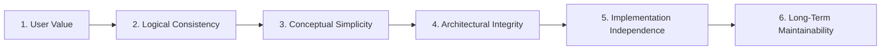

# Decision Validation

> Every language decision must pass a set of independent validation gates.
> Each gate examines the proposal from a different perspective.

---

## Overview

A language design proposal is not complete when it works in one
context — it must be sound across multiple independent dimensions.
Decision Validation formalises this requirement: before a proposal
enters the formal specification, it must pass through **six validation
gates**, each with its own lens.

| # | Gate | Core Question |
|---|------|---------------|
| 1 | User Value | Does this solve a real problem for the programmer? |
| 2 | Logical Consistency | Is the proposal internally consistent and free of contradictions? |
| 3 | Conceptual Simplicity | Is the concept as simple as it can be? |
| 4 | Architectural Integrity | Does it fit within the layered architecture? |
| 5 | Implementation Independence | Can it be defined without tying to a specific strategy? |
| 6 | Long-Term Maintainability | Will this decision age well? |

These gates are **independent** — a proposal that passes one gate may
still fail another. Each gate produces a binary verdict (pass / fail)
or a conditional flag. A proposal with any **fail** or unresolved
**flag** must be revised before moving to specification.

---

## Gate 1 — User Value

**Perspective:** *Does this solve a real problem justified by the
project's Vision?*

A language feature must earn its place by serving a tangible
programmer need, not by being technically interesting. The burden of
proof is on the proposal.

| Criterion | Pass | Flag | Fail |
|-----------|------|------|------|
| The problem is stated in user terms (not implementation terms) | Clearly described from the programmer's perspective | Partially user-stated | Stated only in implementation terms |
| The problem is justified by `../../why/VISION.md` | Directly serves a Vision pillar | Indirectly aligned | Contradicts or ignores Vision |
| A realistic code example shows the pain point | Concise, concrete example | Example exists but is contrived | No example provided |
| The benefit outweighs the cognitive cost | Obvious net gain | Marginal trade-off | Cognitive cost exceeds benefit |

**Fail conditions:**
- The problem does not exist outside the compiler implementer's
  experience.
- The feature could be implemented as a library without language
  changes.
- The use case is speculative (no evidence that real code would need
  it).

---

## Gate 2 — Logical Consistency

**Perspective:** *Is the proposal internally consistent and free of
contradictions?*

A language concept must follow from its own definitions without
producing paradoxes, ambiguous cases, or context-dependent behaviour.

| Criterion | Pass | Flag | Fail |
|-----------|------|------|------|
| All terms are precisely defined | Every term has a single, clear definition | One ambiguous term | Multiple undefined or contradictory terms |
| No self-referential paradoxes | Rules apply consistently to the concept itself | Edge case identified | Paradox exists (e.g., a rule that invalidates itself) |
| Behaviour is deterministic across contexts | Same input always produces same result | Context-dependent corner case | Behaviour changes by invisible context |
| Composition with existing concepts is defined | Interactions documented for all existing concepts | Partial coverage | Interactions ignored |

**Fail conditions:**
- The definition of the concept contradicts established definitions
  in `../../what/GLOSSARY.md`.
- Two different uses of the same construct produce different
  semantics without explicit syntactic distinction.
- The proposal introduces a special case that only exists to patch
  an inconsistency.

---

## Gate 3 — Conceptual Simplicity

**Perspective:** *Is the concept as simple as it can be, or could it
be expressed through composition of existing concepts?*

This gate enforces Orthon's commitment to a minimal core. Every new
concept must justify its existence against the question: *"Can this
be achieved with what already exists?"*

| Criterion | Pass | Flag | Fail |
|-----------|------|------|------|
| Expressible through composition | Cannot be built with existing concepts | Partial overlap with existing concepts | Fully expressible as composition |
| Single responsibility | Solves exactly one problem | Solves one problem with side effects | Solves multiple unrelated problems |
| No keyword or syntax bloat | No new keywords needed (or exactly one justified keyword) | One new keyword with weak justification | Multiple new keywords without justification |
| Minimal learning surface | Concept is learnable in isolation | Depends on understanding two+ other new concepts | Requires understanding a web of new concepts |

**Fail conditions:**
- A library function or existing modifier sequence can produce the
  same result.
- The feature duplicates the responsibility of an existing concept.
- The proposal introduces syntax sugar that could be a named
  function.

---

## Gate 4 — Architectural Integrity

**Perspective:** *Does the proposal fit within Orthon's layered
architecture and compose freely with existing constructs?*

This gate ensures the decision does not violate the project's
architectural boundaries or introduce coupling between layers
that are meant to be independent.

| Criterion | Pass | Flag | Fail |
|-----------|------|------|------|
| Respects layer boundaries | Operates entirely within one architecture layer | Crosses layers with clear justification | Violates layer separation |
| Composes orthogonally | Combines freely with all existing constructs | One known incompatibility | Multiple special-case restrictions |
| No privileged position | Treats all constructs equally | Minor preferential treatment | Some constructs are "more equal" |
| Consistent with `../../how/architecture/ARCHITECTURE.md` | Fully aligned | Minor deviation documented | Contradicts the architecture |

**Fail conditions:**
- The proposal requires the Standard Library to know about compiler
  internals (or vice versa).
- An existing concept must be modified to accommodate the new one.
- The feature creates a layering violation that forces future
  proposals to work around it.

**See also:** `../../how/architecture/ARCHITECTURE.md` for the
layered architecture definition.

---

## Gate 5 — Implementation Independence

**Perspective:** *Can the concept be defined semantically without
tying it to a specific implementation strategy?*

Orthon separates *what* from *how*. A concept must be expressible as
a semantic definition that any implementation strategy can realise
without changing the programmer's mental model.

| Criterion | Pass | Flag | Fail |
|-----------|------|------|------|
| Semantic definition is strategy-agnostic | Behaviour fully defined without referencing implementation | Minor implementation leak | Definition requires specific strategy |
| All strategies can support it | All defined strategies can implement it naturally | One strategy requires workaround | At least one strategy cannot implement it |
| Performance is a strategy concern | Performance characteristics are documented as strategy-dependent | Performance implied in semantics | Behaviour changes by strategy |
| Consistent with `../../how/strategies/IMPLEMENTATION_STRATEGIES.md` | Fully aligned | Minor tension documented | Contradicts the strategy model |

**Fail conditions:**
- The proposal's semantics are expressed in terms of how the
  compiler or runtime works internally.
- Different implementation strategies would produce different
  observable behaviour (not just different performance).
- The concept cannot be implemented in at least one supported
  strategy.

**See also:** `../../how/strategies/IMPLEMENTATION_STRATEGIES.md`
for the strategy model, and individual strategy documents for
specific constraints.

---

## Gate 6 — Long-Term Maintainability

**Perspective:** *Will this decision age well? Is the evolution path
clear, and does the proposal incur conceptual debt?*

A language lives for decades. This gate examines whether the decision
can survive evolution without becoming a constraint or a regret.

| Criterion | Pass | Flag | Fail |
|-----------|------|------|------|
| Evolution path documented | Clear how the feature can be extended without breaking changes | Partial evolution path | No evolution path |
| Conceptual debt assessed | No conceptual debt | Minor debt with documented mitigation | Significant conceptual debt |
| Reversible decision | Decision can be deprecated without ecosystem breakage | Deprecation is costly but possible | Decision is irreversible once adopted |
| Compatibility impact is bounded | Affects only new or isolated scope | Affects existing syntax minimally | Breaks existing code or mental models |

**Fail conditions:**
- The proposal paints the language into a corner where a desirable
  future feature would be impossible.
- Deprecating or removing the feature would break programs in
  unpredictable ways.
- The concept would need to be fundamentally rethought in the next
  major version.
- The proposal relies on a syntactic or semantic pattern that would
  block orthonormal extension.

---

## Gate Flow

A proposal does not need to pass gates in strict order, but the
recommended sequence is:

**Rules:**
- A **Fail** at any gate sends the proposal back for revision. The
  revision must address the specific fail condition before
  re-entering the same gate.
- A **Flag** means the proposal may proceed but the flagged issue
  must be resolved before the final gate. Unresolved flags at
  Gate 6 block the proposal.
- Gates may be revisited as the proposal evolves. A change that
  addresses a previous fail condition may surface new issues in a
  later gate.

---

## Relationship to the Language Design Gate

The existing [`_language-design.md`](_language-design.md) is a
fill-in checklist that operationalises the six validation gates into
a single concrete review form. While Decision Validation defines
*what* must be checked and *why*, the Language Design Gate provides
the *how* — a structured template for recording the outcome of each
check.

When using the Language Design Gate, each criterion in that checklist
should be traceable to one or more of the six validation gates above.
This ensures broad coverage and prevents any single perspective from
dominating the review.

---

## Decision Journal

Use this table to record decisions validated through these gates.
Each row captures one proposal and its outcome across all six gates.

| Date | Proposal | Gate 1 | Gate 2 | Gate 3 | Gate 4 | Gate 5 | Gate 6 | Verdict |
|------|----------|--------|--------|--------|--------|--------|--------|---------|
|      |          |        |        |        |        |        |        |         |
