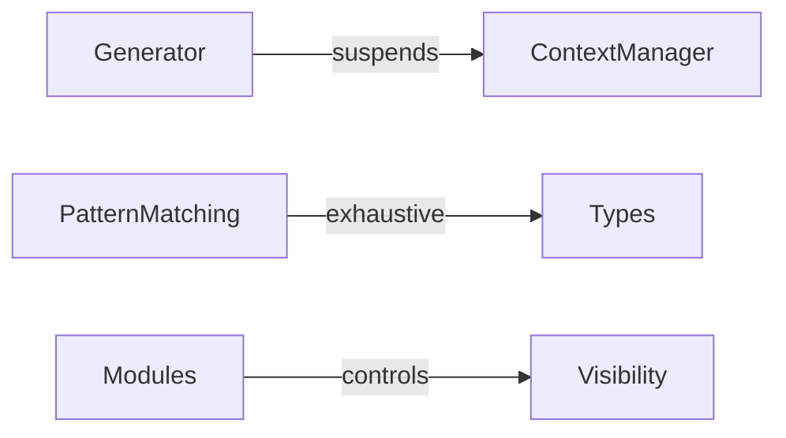

# Interaction Matrix Format — Research Note

> **Status:** 🟡 Investigating
> **Related:** Milestone 3 (Cross-cutting Review)
> **See also:** `docs/when/ROADMAP.md` § Milestone 3

## Purpose

Define the concrete format for documenting and analysing interactions
between language concepts during the Cross-cutting Review (Milestone 3).

## Current Recommendation

Until the investigation is complete, adopt a **dual approach**:

1. **Per-concept "Interactions" sections** (Milestone 2, step 7) —
   Each Concept Design Review document includes an "Interactions"
   section that describes how the concept interacts with all existing
   accepted concepts.

2. **Consolidated matrix** (Milestone 3) — During Cross-cutting Review,
   all per-concept interaction data is aggregated into a centralized
   matrix. This matrix reveals systemic conflicts, clusters of
   compatibility, and gaps in coverage.

## Open Questions

The following questions need to be resolved before the final format
can be defined:

| # | Question | Priority |
|---|----------|----------|
| 1 | Should the matrix be a Markdown table, a Mermaid diagram, or a separate document per concept pair? | High |
| 2 | How do we represent interaction severity? (compatible / constrained / incompatible / undefined) | High |
| 3 | Should interactions be directional? (A×B may differ from B×A) | Medium |
| 4 | How do we track interactions that change as concepts evolve during Milestone 2? | Medium |
| 5 | Is there an existing tool or format (e.g., ArchiMate, C4, ADR interaction records) that fits? | Low |

## Candidate Formats

### Option A: Adjacency Matrix (Markdown table)

```
| Concept | Data | Functions | Modules | Types | ... |
|---------|------|-----------|---------|-------|-----|
| Data    |  —   | ✅        | ✅      | ✅    |     |
| Functions | ✅ | —        | ✅      | ⚠️    |     |
| Modules | ✅  | ✅        | —       | ✅    |     |
| Types   | ✅  | ⚠️        | ✅      | —     |     |
```

**Legend:** ✅ compatible | ⚠️ constrained | ❌ incompatible | ? undefined

### Option B: Per-pair interaction documents

```
interactions/
├── generator-x-context-manager.md
├── pattern-matching-x-types.md
├── modules-x-visibility.md
└── ...
```

### Option C: Mermaid graph



## Next Steps

1. Research existing interaction matrix formats in language design
   (e.g., PLDI, OOPSLA papers on feature interaction)
2. Evaluate against Milestone 3 requirements
3. Propose final format and update this document
4. Update TODO.md with resolution

## References

- Feature interaction problem in telecommunications and programming
  languages (classic PL research)
- ROSEC (Resolving Object-oriented Specifications Effectively and
  Consistently) — interaction analysis method
- EDR Architecture template — `docs/how/templates/_edr-architecture.md`
